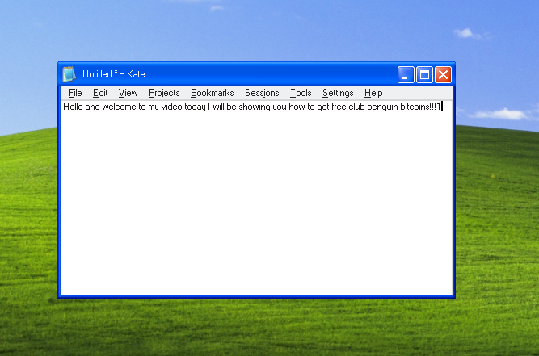

# XBoomer - XP Window Decorations for KDE Plasma

I know you. You long for the days for when life was simple - when your chat program didn't come with an entire browser bundled in. You long for the golden age of Flash when Newgrounds, Ebaumsworld, and albinoblacksheep were king. You long for the days of Counter-Strike: Source and Warcraft 3.

Ok boomer, this one's for you. Welcome home.

[Font](https://github.com/wine-mirror/wine/blob/master/fonts/ms_sans_serif.ttf?raw=true)

# Installation

Drop `aurorae/` into `~/.local/share/`.
